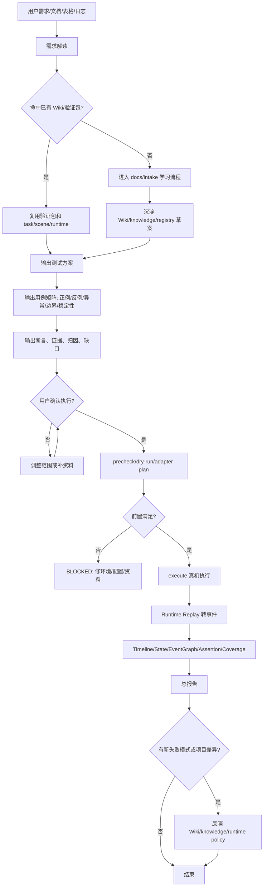
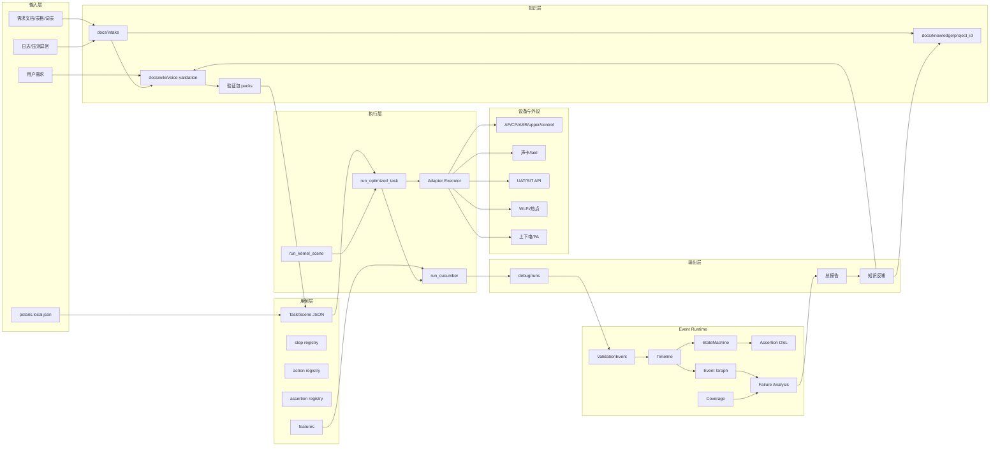
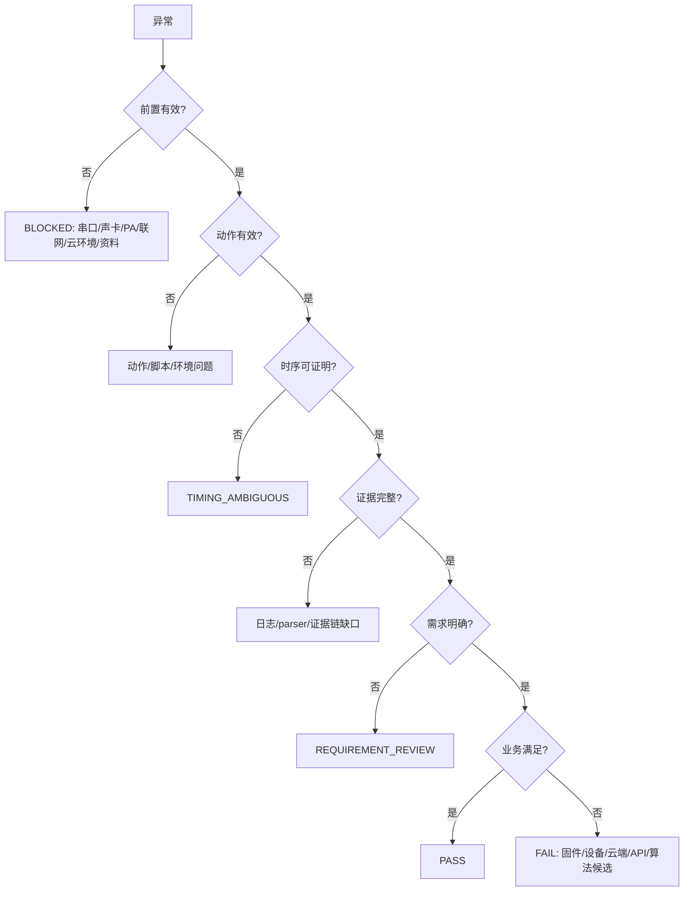
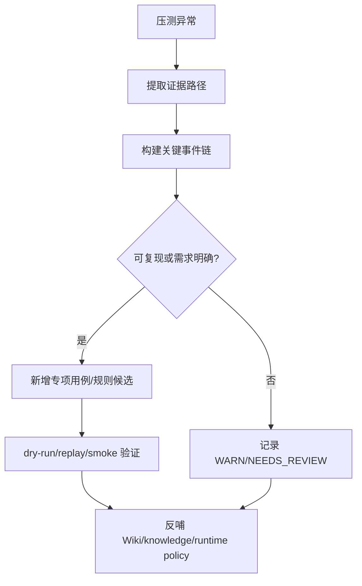

# Polaris Skill 系统化完整需求文档

> 版本：v1.0  
> 日期：2026-05-27  
> 目的：把用户前序提出的所有核心诉求整理成系统化需求，作为后续实现、核对、验收和迭代的基线。

## 1. 总体理解

Polaris 不是一个临时串口调试脚本集合，而是一个面向嵌入式语音设备的 **BDD + Agent Testing + Event Runtime** 真机验证 skill。

核心工作流是：

```text
需求 -> 方案/用例/缺口 -> 用户确认 -> Cucumber/Task/Adapter 真机执行 -> Event Runtime 断言 -> 总报告 -> 知识反哺
```

用户真正希望得到的是一套可复用、可开源、可持续沉淀的验证平台：

- 用户只给一句需求，也能快速生成方案、用例、断言和确认项。
- 已支持功能不再从零调试，而是直接复用 Wiki、验证包、registry、task、runtime。
- 执行阶段必须确定性运行，不依赖大模型联网临时改脚本。
- 真机结果必须能区分固件/设备问题、环境问题、需求问题、脚本问题、测试数据问题和时序不确定。
- 新项目、新功能、新异常都要沉淀成 Wiki/knowledge/registry/runtime，而不是散落在临时目录。

## 2. 背景

前期围绕 WB01、WS63 两类设备已经沉淀了以下经验：

- WB01：AP + CP + ASR/WB01 + 控制串口，适合三端闭环断言。
- WS63：AP + upper/WS63 + 控制串口，无独立 CP，断言必须按项目能力降级。
- 声卡：优先使用稳定 device key；未配置时使用电脑默认声卡。
- PA：声卡播放成功但设备无响应时，控制口执行 `uut-pa.on` 和 `pa-enable.set 0 17 0 1`。
- API：使用云控前必须先把设备端切到 UAT/SIT/PRO 对应环境，并由工具复查到设备端 `env` 与 `cloud.api_environment` 一致；只改 API 环境、不切设备端，或切换后未复查成功，都必须 `BLOCKED`，不能继续调用云端配置 API。
- 压测：必须保存完整串口和动作日志，重启、crash、watchdog、误唤醒、误识别、媒体异常都要记录并归因。
- 旧 `voice-test-plan-designer` 的价值是测试方法，不再作为执行入口；当前应优先使用 `docs/wiki/voice-validation/`。

## 3. 范围与非目标

### 3.1 当前范围

| 类别 | 内容 |
| --- | --- |
| 需求输入 | 一句话需求、需求文档、测试项表格、命令词文件、自由说词表、新项目资料、压测异常日志。 |
| 用例设计 | 正例、反例、异常、边界、稳定性、压测、覆盖率和失败归因。 |
| 执行框架 | Cucumber feature、Task JSON、Adapter Flow、run_task、run_optimized_task、Kernel Scene、Runtime Replay。 |
| 设备控制 | 串口采集、声卡播放、控制口上下电/PA、Wi-Fi/热点、云控 API、UAT/SIT 环境切换。 |
| 断言分析 | Timeline、StateMachine、Event Graph、Assertion DSL、coverage policy、failure analysis。 |
| 项目复用 | `cskwb01`、`venusws63` 和未来新项目 profile。 |
| 知识沉淀 | `docs/wiki` 通用方法，`docs/knowledge/<project_id>` 项目差异，`docs/intake` 新资料入口。 |

### 3.2 当前非目标

| 非目标 | 说明 |
| --- | --- |
| Jenkins 集成 | 用户已明确暂不考虑。 |
| 大规模设备池 | 当前先保证本地真机闭环。 |
| 大规模聚类诊断 | 当前先做确定性事件、规则和报告。 |
| 大模型判定 PASS/FAIL | PASS/FAIL 必须由本地证据和规则决定。 |
| dry-run 当真机结论 | dry-run 只证明配置和执行路径可编译。 |
| 云端返回等同真实播报 | 媒体响应要看设备侧 TTS/media/player marker；有条件时再加声学回采 oracle。 |

## 4. 端到端流程



关键原则：

- Cucumber 只表达人能读懂的测试意图。
- registry/task/adapter/runtime 才是机器稳定执行依据。
- 新功能没有进入 registry/task/runtime 前，只能输出方案或草案，不能说已经可稳定执行。
- execute 必须显式允许副作用，并记录证据目录。
- 最终面向用户输出总报告，不大量倾倒中间日志。

## 5. 系统架构



## 6. 目录要求

| 路径 | 职责 |
| --- | --- |
| `README.md` | 新人入口，说明配置、目录、命令、常见问题。 |
| `SKILL.md` | Codex skill 行为规则，必须中文为主。 |
| `AGENTS.md` | 每次启动读写 `plan.md` 的约束。 |
| `plan.md` | 本地计划和进度，不提交 git。 |
| `polaris.local.example.json` | 可提交配置模板。 |
| `polaris.local.json` | 本机真实配置，不提交 git。 |
| `docs/intake/` | 新项目、新功能、新资料入口。 |
| `docs/wiki/` | 通用测试方法、断言归因、验证包。 |
| `docs/knowledge/<project_id>/` | 项目私有配置、marker、能力差异、coverage 建议。 |
| `docs/skill/` | skill 设计、需求、能力、落地说明。 |
| `satellite/cucumber-agent-testing/` | Cucumber/Task/Runtime 主体。 |
| `tools/` | 声卡、串口、云控、case runner 等工具。 |
| `oldTime/` | 旧方案归档，只追溯，不执行。 |
| `debug/result/cache/_runtime` | 运行产物，不提交 git。 |

## 7. 配置需求

基础配置统一放在根目录 `polaris.local.json`。用户只需要关心：

| 字段 | 说明 |
| --- | --- |
| `active_project` | 当前设备项目，如 `cskwb01` 或 `venusws63`。 |
| `common.audio.default_playback_device_key` | 声卡 key；留空使用默认声卡。 |
| `common.device.wake_word` | 唤醒词，如“小美小美”。 |
| `common.device.wakeup_id` | 日志里的唤醒 ID。 |
| `common.network.wifi_ssid/password` | Wi-Fi 或热点。 |
| `common.timeouts.*` | 识别、半双工、全双工超时和 guard。 |
| `projects.<project>.serial.ports` | AP/CP/ASR/upper/control 串口。 |
| `projects.<project>.cloud.api_environment` | API 环境：uat/sit/pro。 |
| `projects.<project>.cloud.device_env_command` | 设备端切环境命令。 |
| `projects.<project>.serial.control_preconditions` | PA/上电等控制口前置命令。 |

PA 命令必须发到控制口：

```text
uut-pa.on
pa-enable.set 0 17 0 1
```

IoT ID 不应作为所有用例必填项；只有需要云端设备定位或 API 绑定时才需要。

## 8. Cucumber 与注册机制

用户曾明确要求：后续用例生成后，脚本应该脱离大模型和网络稳定执行。因此新 Cucumber 用例不能只写自然语言，还必须进入：

| 文件 | 作用 |
| --- | --- |
| `features/polaris_voice_core.feature` | 人可读场景和 tag。 |
| `references/voice_core_mapping.json` | tag 到执行动作、参数、断言的映射。 |
| `references/step_registry.json` | 自然语言步骤模板。 |
| `references/action_registry.json` | 动作如何落到脚本、串口、声卡、API。 |
| `references/assertion_registry.json` | 指标、阈值、结果口径。 |
| `tasks/examples/*.json` | 可直接运行的任务入口。 |
| `runtime/*` | 事件解析、状态机、断言、replay、coverage。 |

结论：

- 已注册功能可以快速执行，不需要大模型临时生成脚本。
- 新功能必须先沉淀一次，之后才能稳定执行。
- feature 给人看，registry/task/runtime 给机器执行。

## 9. 支持测试项

| 等级 | 含义 |
| --- | --- |
| L0 | 已有 Cucumber/tag/task/runtime，可直接执行或压测。 |
| L1 | 可执行 smoke/探索，正式结论还需阈值、轮次或 oracle。 |
| L2 | 可设计方案和脚本骨架，但需要正式语料、词表、配置入口或云控权限。 |
| L3 | 需要噪声场、DOA、多设备、人工人群、低功耗 rig 等条件。 |

| 测试项 | 当前等级 | 说明 |
| --- | --- | --- |
| 首次唤醒 | L0 | 播放唤醒词，断言 wake marker、耗时、无重启/crash。 |
| 识别模式唤醒 | L0 | 首次唤醒后在识别窗口内二次唤醒，需处理临界超时 guard。 |
| 基础命令词识别 | L0/L1 | 读命令词文件，先唤醒再命令，统计识别闭环。 |
| 半双工识别 | L0/L1 | 需要确认项目半双工切换入口和播报中策略。 |
| 在线全双工识别 | L0/L1 | 已有 FD-001~FD-012 验证包和 task/scene，完整 execute 需确认副作用。 |
| 在线混合压测 | L0/L1 | 基础命令、音乐、相声、新闻、问答、组合随机压测。 |
| 打断唤醒/识别 | L1 | 需要自播窗口、注入时机和打断成功定义。 |
| 在线 VAD/one-shot | L1/L2 | 需要正式间隔、截断容忍和语料 oracle。 |
| 联网恢复 | L1/L2 | 需要可控 Wi-Fi/热点或等价网络控制能力。 |
| 静默/人声/噪声误唤醒 | L1/L2 | 需要监听时长、噪声素材、SNR、触发率阈值。 |
| 唤醒相似词/反集 | L2 | 需要正式反集、相似词和阈值。 |
| 自由说 | L1/L2 | 可抽取/合成小样本，正式结论需要意图 oracle。 |
| DOA/分布式/低功耗/人群 | L3 | 需要专用物理环境或测试集。 |

## 10. 重点验证逻辑

### 10.1 首次唤醒

执行：确认串口和声卡可用 -> 必要时 PA 恢复 -> 播放唤醒词 -> 观察 wake/ASR/提示音/TTS -> Runtime replay。

断言：

- PASS：播放有效，观察窗口内出现项目要求的 wake 证据。
- BLOCKED：声卡缺失、播放失败、串口打不开、PA 未开、设备未上电。
- FAIL：前置有效但无唤醒证据。
- TIMING_AMBIGUOUS：播放起点、音频时长或日志时间不可证明。

时序要求：不能只用播放进程启动作为声学起点；如果播放进程明显长于 wav 时长，优先用 `AudioCompleted - audio_duration_ms` 估算有效波形起点。

### 10.2 识别模式唤醒

首次唤醒必须先成功；第二次唤醒词要落在识别超时窗口内。若注入点在临界 guard 内，标记 `TIMING_AMBIGUOUS`，不能强判固件失败。

### 10.3 半双工

必须先确认半双工切换入口。若配置未生效，归配置/API/环境；若播报中是否允许识别未定义，归 `REQUIREMENT_REVIEW`。

### 10.4 在线全双工

全双工验证必须区分：

- 配置是否生效。
- 首次唤醒后是否连续识别。
- TTS/媒体播放中是否允许继续识别或打断。
- 超时后是否退出识别窗口。
- 临界超时 guard 内样本是否只做边界统计。

FD-001~FD-012 应覆盖配置、连续识别、媒体打断、超时边界、离线/API 环境不一致、声卡/PA、反例、重启/crash、随机压测。

### 10.5 在线混合压测

必须随机类别和随机间隔，不能只跑知识问答。类别包括基础命令、音乐、相声、新闻、做菜问答、百科问答、组合场景。报告要统计轮次、成功率、失败分类、媒体响应、额外 wake/ASR/command、reboot/crash/watchdog。

## 11. 断言与归因

| 状态 | 含义 |
| --- | --- |
| PASS | 前置、动作、证据、禁止行为均满足。 |
| FAIL | 前置有效、动作有效、证据明确不满足功能期望。 |
| BLOCKED | 串口、声卡、PA、联网、云环境、资料缺失导致用例无效。 |
| TIMING_AMBIGUOUS | 播放、超时、自播窗口无法证明注入点有效。 |
| REQUIREMENT_REVIEW | 需求口径不明确。 |
| NEEDS_REVIEW | 探索性用例或缺少正式 oracle。 |

归因顺序：



不能误判：

- 第一次唤醒失败导致命令词未识别，不能算命令词 FAIL。
- 自播打断注入点不在窗口内，只能算时序不明确。
- API 成功但设备端未切 UAT/SIT，属于环境不一致。
- 云端有回复但设备无 player/TTS/media marker，不能说真实播报通过。
- 未播放目标词却出现 wake/ASR/command，要记录为误唤醒/误识别候选。
- 串口被 Xshell/串口助手/旧 logger 占用，应判 BLOCKED。

## 12. Runtime 需求

Runtime 必须 deterministic，同一份日志和配置应得到同一结论。它的职责是把串口、声卡、API、网络、媒体、重启等产物转成 `ValidationEvent`，再通过 Timeline、StateMachine、Event Graph、Assertion DSL、coverage policy 做判断。

核心模块：

| 模块 | 职责 |
| --- | --- |
| `events.py` | 统一事件结构。 |
| `timeline.py` | monotonic 时序。 |
| `state_machine.py` | 状态机与状态健康。 |
| `event_graph.py` | 因果关系，如 ASR 到 TTS/media，media start 到 complete。 |
| `assertion_engine.py` | 固化 profile 断言。 |
| `assertion_dsl.py` | 轻量 DSL。 |
| `state_coverage_policy.py` | 覆盖和禁止事件。 |
| `failure_analysis.py` | 归因和风险总结。 |
| `validation_ir.py` | task/scene/feature plan 统一输入。 |
| `validation_kernel.py` | Kernel 生命周期与后处理。 |
| `plugins/*` | wake/asr/media/network/reboot 领域事件解析。 |

## 13. 新项目/新功能学习

新资料固定放入：

```text
docs/intake/<project_id>/<YYYYMMDD_topic>/
  learning_manifest.json
  raw/
```

学习后按类型沉淀：

- 通用方法 -> `docs/wiki/voice-validation/`
- 验证包变化 -> `docs/wiki/voice-validation/packs/`
- 项目私有配置/API/marker -> `docs/knowledge/<project_id>/`
- 可执行能力 -> feature/registry/task/scene/runtime
- 资料不足 -> gap list

禁止把 intake 原始资料直接当执行依据，也不能把项目私有规则硬编码到通用 Runtime。

## 14. 压测与异常反哺

长时间压测必须全程连接日志。异常闭环目标：

- 新失败模式写入 Wiki 或项目知识库。
- 新专项用例补到验证包。
- 新断言规则补到 assertion registry/runtime profile/DSL。
- 新 Event Graph rule 补到项目 overlay。
- 新 coverage 阈值补到 `state_assertion_policy.json`。

异常到用例流程：



## 15. 报告需求

总报告至少包含：

- 总体结论。
- 用例统计。
- 每条用例结论。
- 关键失败归因。
- 证据目录。
- 设备稳定性：reboot/crash/watchdog/panic。
- 在线媒体响应：TTS/media/player start/complete/error。
- 异常识别：额外 wake/ASR/command。
- 时序边界：guard 样本和不确定样本。
- 后续建议：补资料、修环境、复测、新增规则或用例。

## 16. 验收标准

| 维度 | 验收标准 |
| --- | --- |
| 新人上手 | README 清楚，复制 `polaris.local.example.json` 即可配置。 |
| 需求解读 | 能命中测试项、验证包、缺口和确认项。 |
| 用例完整 | 默认覆盖正例、反例、异常、边界、稳定性。 |
| 执行确定 | 已支持功能走 task/scene/registry/runtime，不临时依赖大模型。 |
| 真机可靠 | 串口、声卡、PA、云环境、网络都可预检和归因。 |
| 报告可读 | 输出总报告和证据目录。 |
| 知识沉淀 | 新资料和异常能进入 Wiki/knowledge/runtime policy。 |

## 17. 当前对齐与可能出入

| 用户目标 | 当前状态 | 可能出入 |
| --- | --- | --- |
| 给需求后快速出方案/用例 | 已有 Wiki/验证包，并补了需求包生成入口 | 生成质量仍依赖验证包完善度。 |
| 执行不依赖大模型 | Cucumber/Task/Adapter/Runtime 已落地 | 新功能未注册前仍不能稳定执行。 |
| 全部走 Cucumber | 业务用例走 Cucumber/Task，底层工具由 Adapter/Runtime 支撑 | 单独 adapter 工具不是 feature，但属于支撑层。 |
| 全双工完整验证 | 已有 FD-001~FD-012 包和 task/scene | 全量真机 execute 需确认副作用后执行。 |
| 媒体真的播了要校验 | 当前看设备日志 marker | 真实声学回采 oracle 仍需配置 capture/loopback。 |
| 压测异常反向生成用例 | 已有方法和报告基础 | 一键 failure-to-test-case 仍是后续增强。 |
| 项目私有规则准确 | 有 overlay 位置 | 需要更多 WB01/WS63 真实日志。 |

## 18. 优先级路线

P0 已完成或必须维持：

- 需求包生成。
- Cucumber/Task/Runtime 执行。
- 执行总报告。
- 串口占用、声卡、PA、云环境 BLOCKED 归因。
- WB01/WS63 基础 smoke。

P1 后续增强：

- 在线全双工全矩阵真机执行。
- 媒体/声学回采 oracle。
- failure-to-test-case 自动草案。
- 项目私有 Event Graph 和 coverage 阈值。

P2 专项：

- DOA、分布式唯一唤醒、低功耗、噪声场、人群、距离/角度等物理场景。

## 19. 结论

当前方向与用户目标基本一致：Polaris 应作为一个持续迭代的语音设备验证 skill，核心价值是把需求、用例、执行、断言、报告、知识沉淀串成闭环。当前最需要持续强化的是：让需求包生成更自动、更准确；让媒体真实出声 oracle 更可靠；让压测异常能更自动地生成专项用例和规则。
